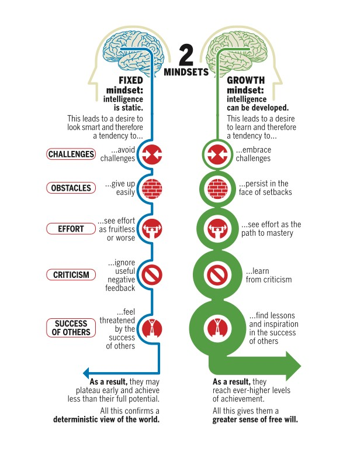
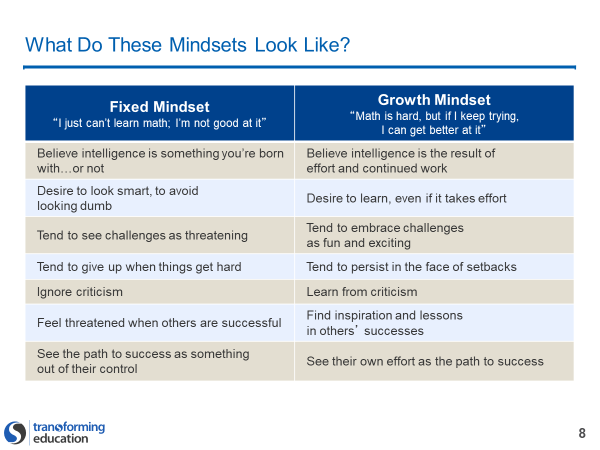

Play: Building a high-performing team: Growth Mindset
=====================================================

What is it:
-----------

A joke we have on our team is that "we have awesome meta-skills," in all
seriousness however, learning is one of those skills. We all have the ability to learn, no
matter our level of intelligence or existing skill level. As I potty trained my
young child, I’m constantly reminded that even the most basic of functions are
learned to some extent! We humans have a superpower to be life-long learners,
however, it is easier for some people to be fast learners if they unlock the
right mindset.

In this play, we’ll practice how having a growth mindset unlocks this
meta-skill. In today’s technology driven world, with the rapidly
changing-landscape, having this skillset is a must, and when the entire team has
a similar mindset, high-performance is sure to follow.

>   Pro tip: One of the key differences in Product Teams versus Project teams is
>   that long-lived Product teams learn as they grow over a longer period of
>   time….

When to use it:
---------------

-   At all times with all teams, in all stages of capability and maturity
    levels.

-   This play works in parallel with the other “[My
    Mindset](https://github.wdf.sap.corp/IT-Agile-DevOps-CC/Playbooks/tree/master/AgilePlaybook/Building_a_team/My%20Mindset)”
    plays

Expected outcomes:
------------------

-   An individual with a growth mindset increases his or her ability to
    constantly learn and improve.

How to execute it:
------------------

-   Recommend Time: 1.5 hours to internalize the concept and techniques,
    30-minute peer to peer discussion.

-   Recommended update: Daily - Remember that we can grow.

### Growth Mindset play:

#### Growth Mindset learning:

1.  **Watch this** [TED
    talk](https://www.ted.com/talks/carol_dweck_the_power_of_believing_that_you_can_improve?language=en)
    **by Carol Dweck**

2.  **Examine this graphic and slide:**

1.  **Optional learning activity 2:** [Read this
    article](http://www.espn.com/blog/seattle-seahawks/post/_/id/17555/renowned-psychologist-impressed-with-seahawks-culture-of-grit)
    **about the American Football team in Seattle (Go Hawks) and how a growth
    mindset led to championships**

2.  Consider and respond these questions to help develop one’s own mindset. In a
    document, write out some responses to these questions:

    1.  What mindset best describes me? When do I find my mindset shifting (per
        subject, etc)?

    2.  Do I believe that I can increase my level of intelligence, or is that
        something I need to reinforce?

    3.  When experiencing difficulty, but not outright failure, use other
        plays such as:
        [mindfulness](./2020-01-06-Mindfulness.md)
        or [novelty and
        curiosity](./2020-01-10-novelty_curosity.md),
        Ask, "what can I learn about myself in the moment and how can I encourage a
        growth mindset?"

    4.  When faced with failure, what is my reaction? What would motivate me to
        persist?

    5.  What type of intrinsic rewards do I need to continue to reinforce
        growth?

    6.  What high expectations of myself do I need to set to continually grow?

    7.  What type of culture does the team have? Does it conflict with my
        mindset?

    8.  Do I need to ask the team to do something differently in its working
        agreements to support my growth mindset? Does the team value hard work
        greater than easy success?

3.  Discuss your responses with your colleague/peer(s). Are there specific actions
    you can check on to hold each other accountable in the future? Are there
    appointments you can set to encourage each other? Should you set a reminder
    to send a note of encouragement? Figure out a strategy based on your
    intrinsic and extrinsic motivations to keep you in the growth mindset, and
    have your peer or manager support you in these areas.
