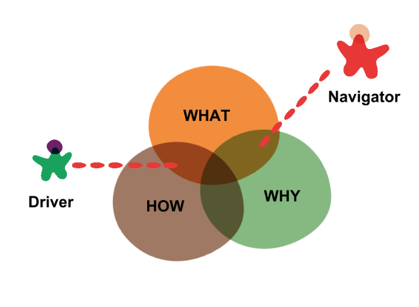
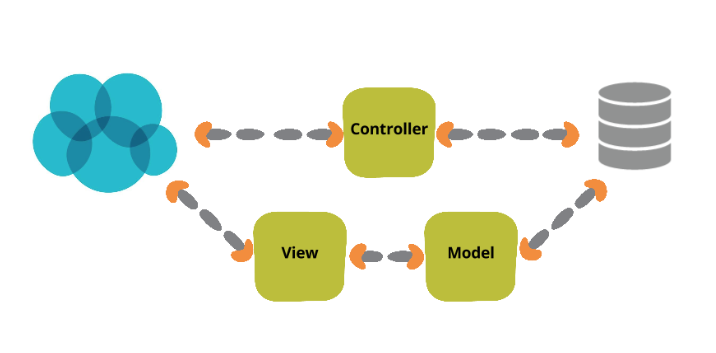

# Play : Pair Programming

## When to use it:
**Pairs work on specification, design, and complex programming tasks** 
Experiments indicate that no quality improvement is shown when working on simple tasks in a pair but there may be speed improvements. Also note that pair "programming" often includes activities other than writing code.

**Pair program when there is a very difficult problem at hand.**
If you can't reasonably break a big problem down into smaller parts then you have a very difficult problem on your hands. That's the kind of thing that should be attacked with multiple programmers. An 8 point story should generally never exist in your organization if you're doing normal web work. Features can almost always be broken down into "front-end" and "back-end" stories. Whole-page mockups can be broken down into component parts. Design and QA phases can also be separated out into their own stories. But a really tough problem is just a really tough problem. Trying to add a new feature to a language is a really tough problem. Trying to figure out how to reduce the latency on database calls is a really tough problem. Those problems that you need to think about both creatively and technically tend to be really tough ones and you should use pairing to address those.

**Pair program when 2 programmers are at completely different skill levels.**
Pair programming is a remarkably good way to teach more junior programmers. Getting to watch live while a more senior programmer talks about how and why they're doing something is invaluable experience. So is writing code while a more senior programmer coerces better practices on the fly. The frequently of those "aha moments" is very high in a situation like this. In my time as a programmer, pairing with somebody significantly more senior than me has been some of the most difficult and most rewarding work I've ever done.

**Pair program when 2 programmers have complementary skill sets.**
If you choose not to break down a story into easily divisible parts, having 2 programmers with different but complementary skill sets can be very rewarding for both the programmers and the codebase. Examples might be pairing together programmers who generally only work front-end or back-end to get an end-to-end feature out the door. Or you might have a Postgres expert pairing with a UI5 expert to make your database calls more efficient. When these 2 people work together live, they absorb a lot of knowledge about each other's domain and in turn make sure that there's no aspect of the project that gets neglected.

**Pair program when you're both new to a language or framework.**
Sometimes you wind up in a situation where nobody is an expert. Even if you're working on a trivial feature you've just wandered into a very difficult problem (see above). This is an excellent situation in which to pair program. There are extra benefits to this as well. Not only do you get two programmers working through a difficult problem and contributing their individual skills to building a better product and helping each other learn, you also get redundancy in the skill growth of your programmers. This is important because the skills in your organization should never be concentrated in one person. If that person gets sick, goes on vacation, or takes another job, you have a big organizational problem on your hands. Having programmers pair on new languages and/or frameworks ensures that there are a minimum of two people who can work on this in the future.

## How to use it:
Pair programming is a style of programming in which two programmers work side-by-side at one computer, sharing one screen, keyboard and mouse, continuously collaborating on the same design, algorithm, code or test.
One programmer, termed as the driver, has control of the keyboard/mouse and actively implements the code or writes a test. The other programmer, termed as the navigator, continuously observes the work of the driver to identify defects and also thinks strategically about the direction of the work.
When necessary, the two programmers brainstorm on any challenging problem. The two programmers periodically switch roles and work together as equals to develop a software.

Most programmers are used to solitary work and often resist the transition to pair programming. However, with practice they can ultimately make this transition.
According to Laurie A. Williams and Robert R. Kessler, in their book, ‘All I Really Need to Know about Pair Programming I Learned in Kindergarten’, it is well explained of how to nurture the skills that we all have learnt in Kindergarten to establish team cohesion, in general and pair programming in particular.
The transition and on-going success as a pair programmer often involves practicing everyday civility.
The following sections are an excerpt of this publication that help you in becoming effective pair programmers.

**Kindergarten lessons**
In Kindergarten, we have learnt the following

* Share everything
* Play fair
* Do not hit people
* Put things back where you found them
* Clean up your own mess
* Do not take things that are not yours
* Say you are sorry when you hurt somebody
* Wash your hands before you eat
* Flush
* Warm cookies and cold milk are good for you
* Live a balanced life – learn some and think some and draw and paint and sing and dance and play and work every day some
* Take a nap every afternoon
* When you go out into the world, watch out for traffic, hold hands and stick together
* Be aware of wonder

Next, we look at the principles of Pair Programming in the context of the above given teachings.

**Share everything**

In pair programming,
* Two Programmers sit together and jointly produce one artifact (design, algorithm, code, etc.)
* One person is typing or writing, the other is continually reviewing the work. Both
    * Are equal participants in the process*
    * Responsible for every aspect of the artifact
    * Own everything

**Play fair**

In pair programming,
* One person drives, i.e. has control of the keyboard or is recording design ideas, while the other is continuously reviewing the work.
* They switch these roles periodically, even when one of them is significantly more experienced than the other, to ensure equal participation.
* While the person who is driving is thinking about implementation, the other continuously reviews code, thinks about a possible simpler design that is possible, how the current development fits in the overall system as of date.

**Do not hit your partner**

In pair programming,
* Ensure that your partner stays focused and on-task.
* You stay focused and on-task.
* Ensure your partner follows the prescribed coding standards and thus maintains the commitment to the rest of the team.

In the pair programming survey, it is found that tremendous productivity gains and quality improvements are realized. This is because −
* Each one keeps their partner focused and on-task with no possibility of slack off.
* Each artifact is reviewed continuously as it is being produced ensuring quality.

**Put things back where they belong**

In Pair Programming,
* You need to believe in your skills and your partner’s skills as well. Any negative thoughts in this aspect are to be put in trash can.
* You have to be sure that you express what you know and are open to learn from your partner when required. You can learn from your partner by observing him or taking his feedback instantly.
* You need to have the confidence that −
    * Wherever there is a possibility of lagging, you can immediately pick up from your partner.
    * Together as a pair, you can solve problems that you could not solve alone.
    * You can help improve each other’s skills.

**Clean up your mess**

In Pair Programming, with the ‘watch over the shoulder’ technique,
* You will find that it is amazing to know how many obvious but unnoticed defects are noticed by your partner.
* You can remove these defects without the natural animosity that might develop in a formal inspection meeting.
* Characterizing defect prevention and defect removal efficiency.

**Do not take things too seriously**

Having a partner to review design and coding continuously and objectively is a very beneficial aspect of pair programming. In pair programming, you need to ensure that you work without excess ego or too little ego.

This is necessary because,
* Excess ego can manifest itself in two ways:
    * Having a “my way or the highway” attitude can prevent the programmer from considering other’s ideas.
    * Being defensive can cause a programmer not to receive constructive criticism or to view this criticism as mistrust.

Both these ways of ego manifestation damage the collaborative relationship.
On the other hand, a person who always agrees with the partner so as not to create tension also minimizes the benefits of collaborative work. For favorable idea exchange, there should be some healthy disagreement/debate when required.

Thus, a fine balance between displaying too much and too little ego is necessary. Effective pair programmers groom this balance during an initial adjustment period that can take hours or days, depending on the individuals, the nature of work and their past experience with pair programming.

**Say you are sorry when you hurt somebody while moving furniture**

The programmers must be able to sit side-by-side and program, simultaneously viewing the computer screen and sharing the keyboard and the mouse. Extreme programmers have a “slide the keyboard/don't move the chairs” rule.

To ensure effective communication, both within a collaborative pair and with other collaborative pairs, without much effort, programmers need to see each other, ask each other questions and make decisions on things such as integration issues. Programmers also benefit from overhearing other conversations to which they can have vital contributions.

**Dishown skepticism before you start**

For success of pair programming, it is necessary that both the partners understand the value of collaboration in programming, the benefits, and the joy of the experience. Any skepticism in this regard needs to be stopped in the beginning itself.

Experience has shown that having one programmer, very positive and/or experienced in pair programming, can lead the pair to become one jelled collaborative team victoriously.

* The production of such a team is greater than that of the same people working in un-jelled form.
* The enjoyment that people derive from their work is greater than what you would expect, given the nature of the work itself.
* Once a team begins to jell, the probability of success goes up dramatically.

**Flush**

The pair programmers can work on something independently. However, when they rejoin, they have to either review the independent work before incorporating it or flush and rewrite the independent work along with continuous review of the work, which identifies additional defects.

Never incorporate any independent work without the review by the partner. This is for the reason that studies have indicated that the independent work has defects as compared to the work produced by the pair.

**Warm cookies and cold milk are good for you**

Pair programmers keep each other continuously focused and on-task. It can be very intense and mentally exhausting. Hence, periodically take a break to maintain the stamina for another round of productive Pair Programming.

During the break, it is best to disconnect from the task and approach it with a freshness when restarting. Suggested activities are checking email, making a phone call, browsing the web, or taking a Snack-break.

**Live a balanced life**

Communicating with others on a regular basis is the key for leading a balanced life. Informal discussions with your partner and with other programmers allows exchange of effective ideas and efficient transfer of information.

**Take a break from working together every afternoon**

It is not necessary to work separately every afternoon, but it is acceptable to work alone 10-50% of the time. This is because:
* Many programmers prefer to do experimental prototyping, tough, deep-concentration problems and logical thinking alone.
* Simple, well-defined and routine coding is done more efficiently by a solitary programmer and then reviewed with a partner.

**Watch out for traffic, hold hands and stick together**

In Pair Programming,
* There should be no competition between the two. Both must work together as if the artifact is produced by a single mind.
* The Partners need to trust each other’s judgement and each other’s loyalty to the team.
* A partner should never blame the other partner for any problems or defects.

**Be aware of the power of two brains**

When two are working together, each has their own set of knowledge and skills, comprising of:
* A common set of this knowledge and these skills that enables them to communicate effectively.
* Unique skills that allow them to contribute to accomplish their tasks.

Together, a pair will :
* Come up with more than twice as many possible solutions than the two would have when working alone.
* Proceed more quickly to narrow in on the best solution.
* Implement it more quickly and with better quality.
* Thus, pair programming is a powerful technique as there are two brains concentrating on the same problem all the time. It forces one to concentrate fully on the problem at hand.

## Expected outcome:
The significant advantages of Pair Programming are −

1. Many mistakes are detected at the time they are typed, rather than in QA Testing or in the field.
2. The end defect content is statistically lower.
3. The designs are better and code length shorter.
4. The team solves problems faster.
5. People learn significantly more about the system and about software development.
6. The project ends up with multiple people understanding each piece of the system.
7. People learn to work together and talk more often together, giving better information flow and team dynamics.
8. People enjoy their work more.

**Pair Programming research reveals that**

- Pairs use no more man-hours than singles.
- Pairs create fewer defects.
- Pairs create fewer lines of code.
- Pairs enjoy their work more.

University of Utah conducted experiments on pair programming. The results revealed that −
- Pairs spent 15% more time on the program than individuals.
- Code written by pairs consistently passed more test cases than code written by individuals.
- Pairs consistently implemented the same functionality produced by individuals in fewer lines of code.
- Learning how to program in an environment where there are rapidly tangible results is fun and allows one to learn faster.

## Effective "navigation" when paring

#### What is a Good Navigator Concerned About?
**A Clean and Safe Environment**

First things first: basic etiquette of sharing a physical and a virtual working space with another person should apply, and the pair should be responsible for ensuring, before a programming session starts, that the working area is clean and comfortable for both individuals.

They should avoid any unnecessary noise or smell and respect each other’s personal space. Additionally, there’s a need to consider a healthy number of breaks during the day, as tiredness can develop more quickly due to the more active communication that pair programming usually demands.

**A Consistent Environment**

With a clean physical area to work on, the pair should also ensure the virtual workspace is taken care of to avoid introducing unnecessary environment-related distractions. Any unrelated work is cleared, at least visibly, and the workstation is configured consistent with other development environments and meets the expectations of both developers.

Editor settings and dotfiles can be easily shared across with the team and kept under source control, but it’s worth paying attention to other things like font sizes, screen resolution, other running applications and pop-up notification settings that might creep up and become distractions. Navigators should have free reign to remind over-enthusiastic drivers changing those, and of the benefits and trade-offs of consistency against personal preference.

*Mapping the Course*

Before the programming starts, it’s important for the navigator to ensure their pair knows and is able to clearly state the goals they are headed towards. Getting to that state might involve discussing details of a story or task with product or technical leaders of the project, and breaking down any larger items into bite-sized chunks. Usually, pairs will do that together at the beginning, and the navigator takes the responsibility of keeping a “goal stack” up-to-date as the work progresses:

Working with a stack has another advantage: while thinking through the tasks needed to complete the programming session, the navigator has to flip between thinking backwards (in what state do we want to leave this system in?) and forwards (what do we need to do to get to the next step?), and we find that a stack lends itself to that kind of back-and-forth quite naturally.

Reviewing the changes needed to the code usually leads to more items and detail to be added to the stack. Sequencing and prioritizing that work effectively requires some practice, in particular when balancing the stack: ensuring any chances to do opportunistic refactoring are taken into consideration while ensuring to not take on too much additional work.

In some teams, pre-flight checklists are put at the top of the goal stack: before work begins, some pre-defined tasks have to take place like moving the card referring to that story in a Kanban wall, creating a feature toggle or branch, or refreshing a local copy of a production database are recurring examples. Similarly, post-flight checklists might require developers to move the card again, do a desk-check with product and technical leaders, demo the functionality to a user, etc.

*Course Correction*

As they go through the goal stack, driver and navigator will eventually detour into some unknown part of the system, or a corner case in the acceptance criteria of the functionality. At these points, a navigator has to be conscious of their role in ensuring the pair is going through the planned tasks or readjust the plan accordingly.

While it’s acceptable to leave some unknowns or dirt behind in order to get the job done, a good navigator knows when to say “not right now”. To that effect, multiple funny-looking acronyms have been created like DTSTTCPW, KISS, YAGNI and so on.

These acronyms may even be used as the navigator as commands, analogous to the rally navigator who says “stay to the left, 300 metres” or a well-placed and thought through “you ain’t gonna need it”, when discussing bringing in a third-party library for example, can stop a lot of unnecessary stress. A good navigator, freed from dealing with the mechanics of driving, should be able to spot those moments and see pitfalls coming from further away than the driver. That is not to say that the opinion of the driver shouldn’t count, of course it should. Negotiating these decisions is a job for both the driver and navigator, but ultimately the responsibility for doing it effectively and pragmatically lies with the latter.

Another common “command” a navigator might use is “let’s start with a test for this.” It might seem mundane at first, but we found that when the navigator takes responsibility for keeping the TDD cycle in check, the red-green-refactor cycle becomes a more fluid experience.

*Clearly Communicating Intent*

It’s easy for novice navigators, even more so those who are seasoned programmers, to get carried away into treating the driver as an order-taker or IDE operator with no particularly good judgment of what’s going on. This undermines the value of pair programming, as the point is to make joint design and implementation decisions, which is best avoided.

Still, sometimes the driver gets stuck on how to proceed on a less abstract problem like issues with an unfamiliar tool, language or API pop up rather frequently. A trap many well-meaning but less experienced navigators fall into fairly often is to offer up advice as soon as that happens. Good navigators know when to wait a little bit before pointing out a missing semicolon somewhere, and will do it when there’s a natural pause in the driving. A very large number of interruptions rising from unfamiliarity of the driver might be a good indication that it’s time to swap roles, even if for a very short amount of time.

For all the more interesting and more abstract issues, though, an experienced navigator is good at communicating intent – the what, not the how, and uses inclusive language (“us” and “we”, rather than “I” or “you”) as much as possible while at it, so the driver is invited to revisit some of the motivations behind intents they might not necessarily agree on.

Even when intent has been communicated clearly, we find that explicitly asking for confirmation is a good practice as it validates understanding and opens the conversation to feedback from the driver.

*Visualizing the Course*

Another set of tools a navigator has at their disposal in this regard is the plain old pen. Drawing and sketching are some of the best ways to show someone what a path might look like.

**Pseudocode**
Some algorithms and data structures can be a little unclear in UML. Pseudocode is usually most employed when discussing small parts of the code like a caching strategy implementation, but can be useful at the beginning of a programming session, when creating the goal stack. At that point, each “line” of pseudocode could thought of as an item in the stack.

**Boxes and Arrows**

Most systems will have their features implemented following a consistent architectural pattern. In a typical database-backed web application, for example, many of the features can be explained by adding in some more detail to the following diagram:

Jotting down this diagram on a piece of paper large enough to accommodate new collaborating boxes and changes to arrowheads can be a good way for a pair to start thinking about the current state of the system, or which modifications and additions are needed.

**Sketch UML and UI**

Though it has somewhat fallen out of favor, UML is an excellent way to describe systems in a visual manner. We prefer to use UML as a sketch while explaining a class hierarchy or set of interactions between systems.

Forward and reverse engineering are equally well served by sketching some UML. Being able to erase parts of a whiteboard selectively can be useful in detailing the steps of a larger refactoring, for example.
