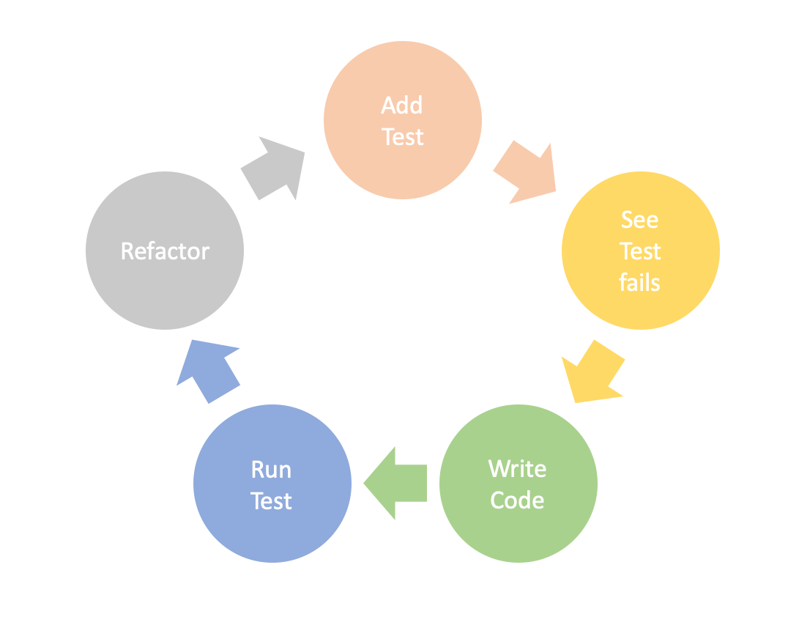

# Play : Test Driven Development

## What is it: 
Test driven development, or shortly TDD, is a software development process mainly used to cover the lowest part of the testing pyramid.  
The outcome of this process is a very short development circle. 



Let's imagine we want to implement a new class.  
You start your development session by writing a very simple test. It should only check, if your class exists. As you haven't developed anything by now except the test itself, the test will turn red. Now we move on to our third bubble in the circle and implement the basic construct for our new class. After we rerun our test, it should turn green now. In our first few iterations there may not be enough code to already refactor it, but as you go further and repeat this process again and again you should also continuously refactor what you are working on. 

The main benefits of the TDD approach are:

1. very high test coverage on the unit test level
2. simpler software design
3. better maintainability
4. higher over all quality


## When to use it:
**In general you could say: "Always go for TDD". But let's highlight some common situations.**

**Starting a new project with no existing code.** The dream of every developer becomes true! There is nothing you can break, no existing code yours should better match to regarding styling, no test you need to keep green, nothing that hinders you from being super creative and do whatever you want! Sounds like Disneyland to me.  
Still, you should take a deep breathe and thing about the future of the project first. What could possibly go wrong, if you just start with whatever comes into your mind? I see things burn and ... . No, that doesn't sound like something you would like to achieve, does it?  
That's why you should start all projects with a plan. Or let's even call it a vision. Where do you want to come out at the end? Do you want a super creative result? Yes, but do you want a messy creative result? Probably not.  
You should take your time to think about how you want to tackle the upcoming problem. You could, for example, draw a graph with all the classes you may need and how they are connected to each other. An ULM-diagramm can be helpful here, too.  
And now, finally, after we made all these fancy pancy plans, we go to our desk, sit down, pull the keyboard in front of us and start hacking the shit out of these keys!  
No, actually this is probably not what you're gonna do. Because now we can start our super simple development process we introduced above and write our first super tiny unit test. Then we run it, we write some small line of code, we run the test again, we code, and so on. Only a few lines of code at a time. No super fancy hacking here, sorry. But, **TDD makes it super easy for you to stick with the plans you designed earlier**.

**Working on a problem in very sensible code.** The more sensible a code part is, the more important are tests. Not only for you as a developer, also for your company who is selling this stuff to paying customers. Let's imagine you need to touch code that is responsible for the successful start of a rocket. Are you really sure you want to start writing test AFTER you implemented all your changes? What if you forget to test one simple function, but that function has some undiscovered impact on other functions and then ... BUMM! No, nobody wants that.   
Wouldn't it be a good idea to have a test already at hand for every line of code you are going to change? Being safe is never a bad idea.

**Working on existing and badly maintained legacy code.** We already talked about every developers dream, now let's talk about the nightmare! Thousands and thousands lines of code, no or only few tests at all, so many different functionalities, nobody left in the company who was part of the development of this software. And now, you need to touch it!  
It feels nearly the same as working on very sensible code. You have obviously no clue what could go wrong if you change something. Well, to be honest, you should first try to build up a safety-net before you start developing new content in legacy code. But as this might not always be possible, always try to go for a TDD approach. So that at least your new code will definitely be covered with as many tests as possible. Then, on a longer run, you will end up with a safety-net automatically.

**Continue working on an agile project.** If you jump into an agile project, there may already be many, many test. But there are never too many test. At least not in real life. Just remember, if you add new functionality, also add new test for it. And why not play it safe and directly add them during the implementation?

## Expected Outcome 

- Very high test coverage on the unit test level:  
By doing these short iterations by writing the code you will end up with lots and lots of unit tests.
- Simpler software design:  
To make everything easily testable with unit test you need to create simple structures and smaller functions.
- Better maintainability:  
Identifying bugs is easier. The test that ran red is probably covering only few lines of code. So, the chance that the bug is coming from these few lines is very high.
- Higher over all quality:  
Developers working in TDD care for their code!
- Tests work as living documentation for other developers:  
If your test cover every function in such detail, other developers can have a look into all the test to understand what these functions will deliver as results. Understanding code of somebody else gets much easier and a lot faster by having a high and detailed test coverage.

## How to use it:

To really imagine how to write something in a test driven way, you can try out this simple step by step code example.  
It is recommended, and probably also the easiest, to use TDD for writing Unit tests. If you want to also archive a good regression or integration test coverage, Behavior-Driven-Development with predefined test scenarios is the better approach. But this topic will have its own play.  

This Game is called **Fizz-Buzz** and is relatively simple. We want to print a Fizz, if a number is dividable by 3, a Buzz, id it contains a 3 and Fizz-Buzz, if both apply. Other numbers should be printed directly.

*Note: This example is written in JavaScript code, but can be applied on multiple other programming languages by simple adjusting the syntax differences. You may also need to start a local server, to run your code properly.*

- Open your preferred development environment.
- Create a new file for your unit test. (e.g. `testFizzBuzz.js`)
- Write your first unit test. It should expect that there exists a function (property of the object we placed it in. In our case an object called `controller`) called fizzBuzz.

```
QUnit.test("fizzBuzz function should exist'", function(assert) {
    assert.ok(controller.hasOwnProperty("fizzBuzz"), "There is a fizzBuzz function");
});
```

This test will fail now after you executed it.

We now write our matching code in another file (e.g. `fizzBuzz.js`):

```
{ ...
    { 
        fizzBuzz: function () {}
    }
... 
}		
```
Our test will run green!

- Second round: fizzBuzz function should print out something.

```
QUnit.test("fizzBuzz should print out something", function(assert) {
    assert.equal(controller.fizzBuzz(), "Hello", "fizzBuzz prints out something");
});
```

 The matching code:

```
{ ...
    { 
        fizzBuzz: function () {
            console.log("Hello");
        }
    }
... 
}		
```

- Third round: fizzBuzz function should print out handed parameter.

```
QUnit.test("fizzBuzz should print out something", function(assert) {
    assert.equal(controller.fizzBuzz(1), "1", "fizzBuzz prints out parameter");
});
```

 The matching code:

```
{ ...
    { 
	fizzBuzz: function (number) {
            console.log(number);
    }
}
... 
}		
```

- Fourth round: Now we slowly come to the logic. We want to print a Fizz, if we enter a 3.

```
QUnit.test("fizzBuzz should print out fizz when 3 is parameter", function(assert) {
    assert.equal(controller.fizzBuzz(3), "Fizz", "fizzBuzz prints out Fizz");
});
```

The matching code:

```
{ ...
    { 
        fizzBuzz: function (number) {
            if (number = 3) {
                console.log("Fizz");
	    }
            else (console.log(number);)
	}
    }
... 
}		
```

All our test should stay green now, also the one with the **1** as parameter.

- Fifth round: We want to print a Buzz, if we enter a 9, because it's dividable by 3.

```
QUnit.test("fizzBuzz should print out Buzz when 9 is parameter", function(assert) {
    assert.equal(controller.fizzBuzz(9), "Buzz", "fizzBuzz prints out Buzz");
});
```

The matching code:

```
{ ...
   { 
        fizzBuzz: function (number) {
            if (number = 3) {
            	console.log("Fizz");
            }
            elseif (number = 9) {
            	console.log("Buzz");
            }
            else (console.log(number);)
	}
   }
... 
}		
```

- Sixth round: Now we want to be able to reserve a Buzz when we enter a 6. We need to adjust out case.

```
QUnit.test("fizzBuzz should print out Buzz when 6 is parameter", function(assert) {
    assert.equal(controller.fizzBuzz(6), "Buzz", "fizzBuzz prints out Buzz");
});
```

The matching code:

```
{ ...
    { 
	fizzBuzz: function (number) {
	    if (number = 3) {
	        console.log("Fizz");
	    }
	    elseif (number % 3 = 0) {
	        console.log("Buzz");
	    }
	    else (console.log(number);)
	}
    }
... 
}		
```
All our test should stay green now, also the one with the **9** as parameter.

- Seventh round: 3 Should actually return a FizzBuzz and not only a Fizz.

We can now refactor our existing test for parameter 3 with the correct expected result. If we wouldn't refactor and write a new test instead, the old one would fail.

```
QUnit.test("fizzBuzz should print out FizzBuzz when 3 is parameter", function(assert) {
    assert.equal(controller.fizzBuzz(3), "Buzz", "fizzBuzz prints out FizzBuzz");
});
```

The matching code:

```
{ ...
    { 
	fizzBuzz: function (number) {
	    if (number % 3 == 0 && number.toString().indexOf('3') > -1) {
	    	console.log("FizzBuzz");
	    }
	    elseif (number % 3 == 0) {
	    	console.log("Buzz");
	    }
	    else (console.log(number);)
	}
    }
... 
}		
```

- Eighth round: We are missing the whole Fizz logic now.

```
QUnit.test("fizzBuzz should print out Fizz when 13 is parameter", function(assert) {
    assert.equal(controller.fizzBuzz(13), "Buzz", "fizzBuzz prints out Fizz");
});
```

The matching code:

```
{ ...
    { 
	fizzBuzz: function (number) {
	    if (number % 3 == 0 && number.toString().indexOf('3') > -1) {
	    	console.log("FizzBuzz");
	    }
	    elseif (number % 3 == 0) {
	    	console.log("Buzz");
	    }
	    elseif (number.toString().indexOf('3') > -1) {
	    	console.log("Fizz");
	    }
	    else (console.log(number);)
	}
    }
... 
}		
```

**And that's it! We created a function with full test coverage!**
