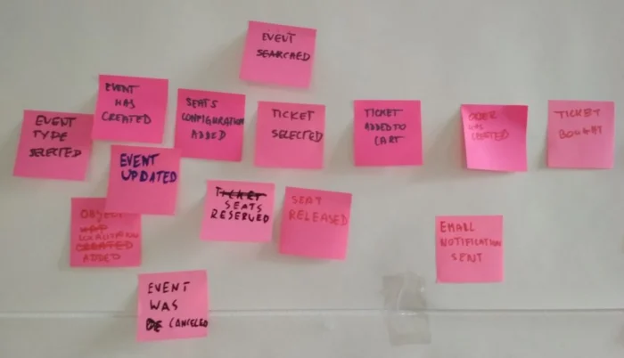
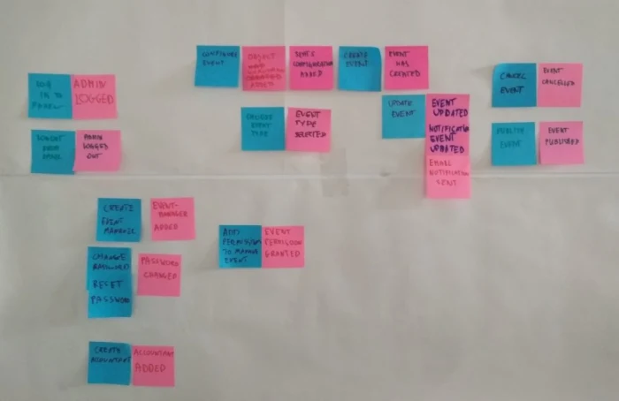
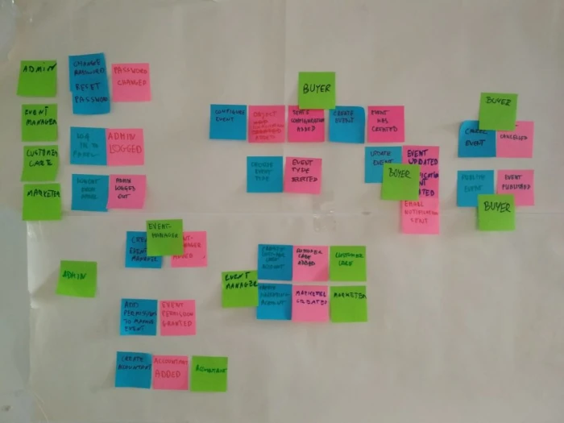
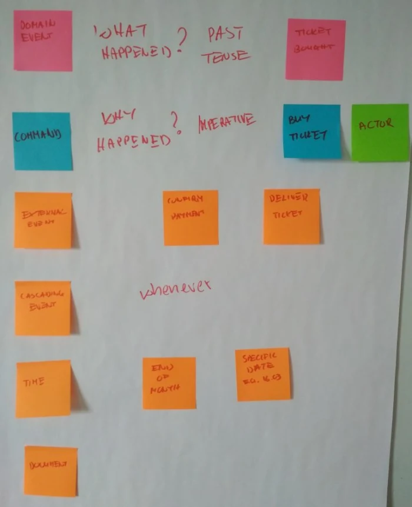

# Play: Event storming workshop

## What is it:

Event storming is a rapid group modeling approach to domain-driven design. Originally created by Alberto Brandolini in 2012 as a quick alternative to precise UML diagramming, event storming is a workshop-style technique that brings project stakeholders together (both developers and non-technical users) to explore complex business domains.

Keep in mind, event storming is not a substitute for a UML diagram, design document, deployment plan, or other implementation models. Rather it is intended to support and accelerate the development process by bringing together relevant stakeholders to quickly model the broader business domain and its processes.

Advantages of event storming
Event storming is designed to be both efficient and fun. By bringing key practitioners into the same room (literally or virtually), event storming has the advantage of being:

- **Fast**: The event storming approach reduces the time it takes to create a comprehensive business domain model. What used to take weeks can be accomplished in hours during a single workshop.

- **Straightforward**: Rather than using complex UML, event storming breaks the process down into simple terms that both technical and non-technical stakeholders can understand.

- **Engaging**: One of the goals of event storming is to make modeling fun. It is a hands-on approach to domain modeling that invites each person to participate and interact. Besides being more enjoyable, event storming also results in more valuable insights as participants more readily engage in the process and offer their suggestions and expertise.

- **Effective**: Event storming is not data modeling. Instead, it results in a full behavioral model that can be quickly implemented and validated. For the best outcomes, teams should combine event storming with implementation oriented toward domain-driven design.

Perhaps the greatest value of event storming is in the conversations it generates. You can use the knowledge gained in the workshop to inform your future modeling processes and build software from them, or you can simply use event storming to better understand your business processes and make better decisions going forward.

## When to use it:

The obvious answer is, to create a business domain model that can be used during development, to get the big picture of the product environment, its needs and goals, and to assess its complexity. But there is more. Event storming supports group learning and is a fun way to integrate development and product teams. It helps if teams want to create alternative solutions together (especially interesting for startups) by visualizing and selecting them. Event storming may also be useful for teams with mature products to order the process and find out about bottlenecks and areas of conflict.

But above all it is about conversation. It’s a new way to share understanding about business objectives and product goals; a way of starting a discussion to discover gaps and hindrances.

Event Storming is a flexible workshop format for collaborative exploration of complex business domains.

It comes in different flavors, that can be used in different scenarios:

- to assess health of an existing line of business and to discover the most effective areas for improvements;
- to explore the viability of a new startup business model;
- to envision new services, that maximize positive outcomes to every party involved;
- to design clean and maintainable Event-Driven software, to support rapidly evolving businesses.

The adaptive nature of EventStorming allows sophisticated cross-discipline conversation between stakeholders with different backgrounds, delivering a new type of collaboration beyond silos and specialization boundaries.

## Expected outcomes:

The simplest answer is: the better the development team knows your business domain, the more profound the initial analysis will be and the preparations to start the implementation phase will be more focused. That directly impacts the general quality of the product you are building, but also the overall cooperation between business and development teams.

It is also a great chance to learn about dependencies in the entire domain that might be less visible on a daily basis, but can significantly affect decisions made about the product, both on the technical and business ends.

Moreover, during an event storming session, the group has the opportunity to extract and discuss small pieces of the domain. And the less complexity at the beginning, the less complicated the problems are as the product development progresses.

## How to execute it:

Event storming has evolved over time, and there are various iterations and approaches you could take. The following steps make up the original basic outline of an event storming workshop. However, you can easily adapt the process to your own needs and goals.

#### 1. Invite the right people
Unlike traditional modeling processes that often rely on a small group or an individual developer to map out data, behavior, and objects, event storming depends on a larger group (at least six to eight people) to workshop the domain model together.

For event storming to be successful, you need the right people to participate.

Who are the right people?

According to Brandolini, they are the people who know the right questions to ask and the ones who have the answers. This group will likely be a mixture of stakeholders representing user experience, business, architecture, development, and IT.

#### 2. Provide unlimited modeling space
The beauty of the workshop approach is its simplicity. The goal is to get on paper (usually color-coded sticky notes) each significant event and process in one big map. To do this, you will need a large modeling space that allows your team to continue building on the process as questions and ideas arise without being limited in scope by the physical workspace.

Traditionally, this approach has been applied with sticky notes on a wall. However, programs like Mural eliminate the concern for adequate space (and the need to have stakeholders all in the same room) by taking the process virtual. Mural has an unlimited canvas workspace that allows real-time collaboration from multiple team members, even those who work remotely or in separate locations.

By focusing on the task at hand, stakeholders can work out the processes in an agile way without getting bogged down in complicated language and complex mapping structures.

#### 3. Explore the business domain
Now for the meat-and-potatoes part of the workshop. Together the group explores the business domain to unveil a comprehensive process. There are three main components of the event storming model: domain events, commands, and aggregates.

##### **Identify domain events**
The first step is to begin identifying events. Events are “things that happen” in a process or system. Important events trigger reactions, so understanding the causal event can help you understand how the system operates and why. Keep in mind that events are always noted in the past tense.

To mark an event on your timeline, use an orange sticky note (or whatever color code you’ve agreed on). In Mural, you can apply the same traditional color coding and shapes to customize the process flow.

As your team adds events to the canvas, start organizing them in sequential order over time.

##### **Connect domain events to commands**
With your events outlined, you can begin to evaluate each event for its causes and consequences. In other words, ask yourself what triggered this event (e.g., users, other events, or external systems).

The trigger or cause of the event is noted as a command. Commands are traditionally documented on blue sticky notes in the present tense and often represent user interactions with the system (e.g., “Submit a purchase order”). However, your team may want to document commands as both user and system actions.

event storming domain events and commands

##### **Connect events to reactions**
The other side of the event process is what happens as a result of the event. These are called reactions.

Reactions are the necessary actions or results following an event and are noted in the present tense. For example, an event-reaction process flow might state, “When a new account is created, we will send a confirmation email.”

Together, commands, reactions, and events will successfully map out the complete cause-and-effect processes of the system.

event storming domain events, commands, and reactions

#### 4. Combine with domain-driven design
For high-level event storming, the process can end once your team has added domain events, commands, and reactions. However, event storming can be combined with the technique of domain-driven design to define the structure of your system and send your team on the way to implementation.

To put it simply, you can start grouping together modules with an element called bounded contexts. Draw a box or circle around the related modules and label them.

Then you can use arrows to begin context mapping—in other words, to show how the modules within a bounded context interact with other contexts. For example, you might have grouped together commands, reactions, and events that deal with payment. The payment context is linked to the shipping context, because once a payment is processed, the system needs to fire a command to ship the product that has been ordered.

#### **Takeaways – Facilitation Tips and Tricks **

**Questions and narration**
If you are taking part in a workshop or actual session as a facilitator, your role is to help the participants stay focused and fully explore the domain. With this in mind, ask them questions such as:

- How does the process look on a regular basis?
- How would it behave in an ideal world?
- What could possibly go wrong?
- Who is affected by a particular action?
- How can we measure progress?

Reverse narrative is also good practice; for example:

- What must happen before a specific event can take place?
- What path led us to this moment?

**Sticky notes**

The color of the notes matters. I used a variety of light pastel colors but in practice it was difficult to tell the different colors apart at first glance here. Vivid colors are definitely a better choice.

**Business domain**

If you are just learning and not modeling an actual business, consider selecting a less complex business domain to practice with. That way, during the workshop, the group can focus on the event storming process and not the complexity of the business itself (though of course the business should be the focus of a real event storming session).

**Language**

Think about the language that you use to conduct the workshop. I was prepared to use English, which I consider to be more natural at work, so all my examples, slides and materials were in English. Imagine my surprise when the participants wanted to use Polish! Eventually, we managed but I might have overlooked a few details.

**Legend**

That leads us to creating the legend. It should be prepared in the same language as the workshop and put directly onto the wall. It would also be a great idea to create legend board rules and some follow-up questions (e.g. ‘command’ can be accompanied by ‘something that a person does’ and ‘why something happened’?)

**When are we done?**

At the end of the workshop, someone asked how do we know when the business model is ready. Unfortunately, there is no definitive answer but there are actions that we can take in order to gain a level of certainty:

- Make a short summary at the end of each block. If people worked in groups, ask them to sum up the discussed areas. After that check with the business as to whether they see any important aspects that have not been mentioned so far.
- Ask questions regarding the areas that were discovered. At some point there will be no more paths related to event or command.
- Make a map of the discussed areas. It could be a base for your user story map, but it also serves as an outline of covered topics.

#### Further Reading
[Domain-Driven	Design Reference (PDF)](https://domainlanguage.com/wp-content/uploads/2016/05/DDD_Reference_2015-03.pdf)
[An Introduction to Domain-Driven Design](http://www.methodsandtools.com/archive/archive.php?id=97)
[Domain Driven Design (Book)](https://www.oreilly.com/library/view/domain-driven-design-tackling/0321125215/)

Original material:
* https://www.meetup.com/de-DE/Agile-Luxembourg/events/260285788/
* https://www.lucidchart.com/blog/ddd-event-storming
* https://www.boldare.com/blog/event-storming-guide/
