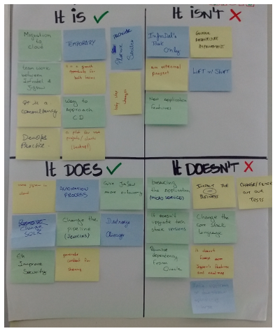
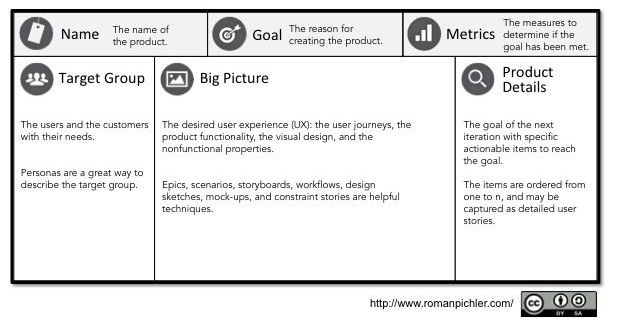
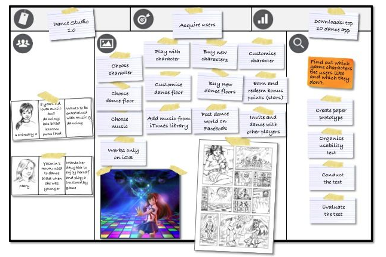

# Play: Creating a product canvas

## What is it:

This play is an exercise to be run by the product owner ( not limited to ) with the business and the stockholders involved in the product definition.

In order to get from an idea to a product launch, we need a vision of the product to help us to trace the initial path. This vision defines the essence of the business value of the product and must reflect a clear and convincing message to the product's users. This activity will help us to collaboratively define the vision of the product.

This activity is based on Geoffry Moore's "vision of the product” from [Crossing the Chasm](https://www.amazon.com/gp/product/0062292986?ie=UTF8&tag=martinfowlerc-20&linkCode=as2&camp=1789&creative=9325&creativeASIN=0062292986).

This play refers to the guardrails:

-   Place the link to the guardrails that this play refers to. It might be more than one.

## When to use it:

- To define a new product based on user or business goals

- When to reevaluate an existing product, in terms of fit for purpose and process replenishment

- To reaffirm the alignment of the set of futures to the product goals

## Expected outcomes:

Basically, the Product Vision Board answers the following questions:

* Why are we creating the application?
* Who is our target group of users?
* What are their needs?
* How do we envision our product to meet those?
* What are our business goals in doing so?

It also serves as input for the Product Canvas. Both are the responsibility of the Product Owner. However, that doesn’t mean that they have to do all the work. It is highly advised to use the Scrum team and experts where needed.

## How to execute it:

#### Defining the product vision

1. Write the product vision template in a whiteboard or flipchart so that the whole team can see it easily.

2. Divide the team into smaller groups and ask each one to fill one blank slot (if the team is small, they can do more than one).

3. Gather the results of each group to form the final statement.

In this activity it's very common that the resulting sentence is senseless . Ergo, after doing the third step, get the team to work together to form a coherent sentence, using and altering the previous results as necessary.

#### Product Is - Is not - Does - Does not

Sometimes, it’s easier to describe something by saying what it isn't. This activity explores how we might explain the product this way, by asking specifically about each positive and negative aspect of the product.

1. Divide a white canvas or flipchart in four areas: Is / Is not / Does / Does not.
2. Write the name of the product above the quadrants.
3. Ask each participant to describe the product by putting post-its onto the corresponding areas.
4. Read and group similar notes.

This activity helps to explain the product. Afterwards the participants usually have formed a consensus view on what the product does as well as what the product doesn’t do. We can also clarify strategic decisions, such as things the product will never do.

#### Product Canvas

Now its the time to place all the discovery and definitions about the product on the canvas format. The whole idea is that this guides the creation of features and support for product owners on decision making process about functionalities to add or not on this product.

Product Canvas combines form and function, a structure together with suggested techniques. The following diagram and the text below the sections of the canvas.

##### Sections explained

Name simply states the name or version of the product.

The Goal is the product or release goal, the objective that should be met, for instance, to acquire, activate or retain users. If you use the GO product roadmap than you can simply copy the relevant goal stated on the roadmap.

The Metrics provides the measure to determine if the goal has been met, for instance, number of downloads or daily active sessions. If you use the GO product roadmap than just copy the relevant roadmap metrics.

The Target Group describes the target customers and users as personas. The section explains who we believe is likely to use buy and use the product and why. I discuss personas in more detail in my post A Template for Writing Great Personas. Choose one primary persona – the persona you mainly create the product for. Employing a primary persona helps you make the right prioritisation decisions and create a product with a great user experience. Your primary persona should be at the top of the building block to signal its importance.

The Big Picture describes what is takes to meet the persona goals. It captures the user journeys, and the visual design required to create the desired user experience. As its name suggests, it wants to describe your product holistically at a high-level. The section is similar to the outline of a book: It captures the contents without discussing the details.

Scenarios, storyboards, workflow diagrams, and story maps are great techniques to describe the user journeys on the Big Picture. Each journey shows how a persona interacts with the product and the steps the individual has to take to meet a goal. The product functionality on the Big Picture is best captured as epics, which are big and coarse-grained user stories. Epics allow you to describe your ideas without having to commit to the details. This saves time, and it makes it easier to update the canvas with new insights. Constraint stories help you capture the nonfunctional requirements that impact the user experience and the software architecture. You can capture your visual design ideas on the Product Canvas as design sketches, mock-ups, screen-shots, and photos. The Big Picture design artefacts should focus on the critical design aspects of your product—for instance, the design of selected screens or pages.

None of these techniques are mandatory, of course. They rather provide you with a starting point. Choose those techniques that are appropriate for your product. Use additional ones as it suites your needs.

The Product Details provide a goal for the next iteration and just enough implementable items to reach the goal, for instance, to address a risk and to acquire relevant knowledge, or to complete a feature. Depending on the goal, I use different techniques to capture the implementable items. For goals that require coding, ready stories are very helpful. These are small, detailed stories that feed the next cycle and that help create a product increment or minimal viable product (MVP). They are derived from the epics, and are necessary to reach the sprint goal. Make sure you write acceptance criteria for your ready stories. Order the implementable items from one to n, for instance, first, second, third, and so on, to maximise the chances that you reach your goal.

#### References

- [Practical guide to the product Canvas](https://www.mendix.com/blog/a-practical-guide-to-the-product-canvas/)
- [The product canvas - Roman Pichler](https://www.romanpichler.com/blog/the-product-canvas/)
